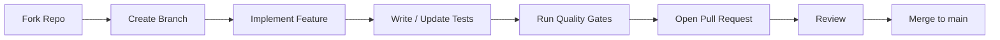

# Contributing to ChatGPT Web Bridge

Thank you for your interest in contributing! 🎉

This document defines the standards, workflows, and quality gates for contributing to this project.

**Copyright holder:** [deco31416.com](https://deco31416.com)

---

## 📋 Table of Contents

1. [Code of Conduct](#-code-of-conduct)
2. [ISO Compliance](#-iso-compliance)
3. [Development Workflow](#-development-workflow)
4. [Branch Naming Convention](#-branch-naming-convention)
5. [Commit Message Standard](#-commit-message-standard)
6. [Pull Request Process](#-pull-request-process)
7. [Quality Gates](#-quality-gates)
8. [Style Guides](#-style-guides)

---

## 🤝 Code of Conduct

### Our Pledge

We pledge to create a harassment-free experience for everyone, regardless of age, body size, disability, ethnicity, gender identity, level of experience, nationality, personal appearance, race, religion, or sexual identity.

### Our Standards

- ✅ Use welcoming and inclusive language.
- ✅ Be respectful of differing viewpoints and experiences.
- ✅ Accept constructive criticism gracefully.
- ✅ Focus on what is best for the community.
- ❌ No harassment, trolling, or personal attacks.
- ❌ No publishing others' private information.

---

## 📐 ISO Compliance

This project follows international standards:

| ISO Standard | Description | Application |
|---|---|---|
| **ISO 8601** | Date and time format | Changelog, commits, releases (`YYYY-MM-DD`) |
| **ISO/IEC 9899:2024** | C Standard | N/A for Python, referenced as baseline |
| **ISO/IEC 14882:2024** | C++ Standard | N/A, referenced for polyglot contributions |
| **ISO/IEC 25010:2023** | Software Quality Model | Maintainability, reliability, security benchmarks |
| **ISO/IEC 27001:2022** | Information Security | Security best practices in code and deployment |

### Quality Attributes (ISO 25010)

Contributions must support:

- **Functional Suitability** — Feature completeness per specification.
- **Reliability** — Resilient to ChatGPT UI changes and timeouts.
- **Usability** — Clear CLI, consistent API responses.
- **Maintainability** — Clean separation of concerns, documented selectors.
- **Portability** — Cross-platform (Windows, macOS, Linux).

---

## 🌿 Development Workflow



### Setup

```powershell
# Fork + clone
git clone https://github.com/YOUR_USERNAME/idea-loca.git
cd idea-loca

# Create virtualenv
python -m venv .venv
.venv\Scripts\Activate.ps1

# Install dev dependencies
pip install -r requirements.txt
playwright install chromium
```

---

## 🌿 Branch Naming Convention

Follows **ISO/IEC 14764:2022** (Software Maintenance) naming patterns:

| Prefix | Purpose | Example |
|---|---|---|
| `feat/` | New feature | `feat/streaming-support` |
| `fix/` | Bug fix | `fix/selector-timeout` |
| `docs/` | Documentation | `docs/api-reference-update` |
| `refactor/` | Code restructuring | `refactor/bridge-singleton` |
| `chore/` | Maintenance | `chore/deps-upgrade` |
| `security/` | Security patches | `security/cors-restrict` |

**Format:** `<type>/<ISO-date>-<short-desc>`

*Example:* `feat/2026-06-04-streaming-support`

---

## 📝 Commit Message Standard

Follows **Conventional Commits v1.0.0** with ISO 8601 dates:

```
<type>(<scope>): <subject>
<BLANK LINE>
<body>
<BLANK LINE>
<footer>
```

### Allowed types

| Type | Description |
|---|---|
| `feat` | New feature |
| `fix` | Bug fix |
| `docs` | Documentation only |
| `style` | Formatting, semicolons, whitespace (no code change) |
| `refactor` | Code restructure (no feature, no fix) |
| `perf` | Performance improvement |
| `test` | Adding or fixing tests |
| `chore` | Build, deps, tooling |

### Examples

```
feat(bridge): add multi-turn conversation support

Implemented conversation history tracking in ChatGPTBridge.
Each send_prompt call now uses the same conversation thread if
new_chat=False.

Closes #12
```

```
fix(bridge): update send button selector

ChatGPT changed the data-testid from "send-button" to
"composer-send-button". Updated SELECTORS dict accordingly.

Closes #24
```

---

## 📥 Pull Request Process

1. **Open an Issue first** — Describe the feature/bug before coding.
2. **Fork the repo** and create your branch following the convention above.
3. **Implement** your change with clear, documented code.
4. **Update changelog** — Add an entry under `[Unreleased]` in `CHANGELOG.md`.
5. **Run quality gates** (see below).
6. **Submit PR** against `main` branch.
7. **Respond to review** — Address all comments.

### PR Checklist

- [ ] Branch follows naming convention.
- [ ] Commits follow conventional commits format.
- [ ] Code passes `ruff` linting.
- [ ] Relevant documentation updated.
- [ ] Entry added to `CHANGELOG.md` under `[Unreleased]`.
- [ ] No secrets, keys, or tokens committed.
- [ ] PR description explains *what* and *why*.

---

## ✅ Quality Gates

Run before submitting a PR:

```powershell
# 1. Lint (ruff)
pip install ruff
ruff check .

# 2. Type check (mypy)
pip install mypy
mypy server.py chatgpt_bridge.py models.py --ignore-missing-imports

# 3. Import integrity
python -c "import server; import models; import chatgpt_bridge; print('OK')"

# 4. Smoke test (start server, hit endpoint, stop)
# (requires manual login)
```

---

## 🎨 Style Guides

### Python

```python
# ✅ Good
async def send_prompt(self, text: str, new_chat: bool = False) -> str:
    """Sends a prompt to ChatGPT web and returns the response."""
    ...

# ❌ Bad
async def sendPrompt(self, text, new_chat=False):
    ...
```

- **Naming:** `snake_case` for functions/variables, `PascalCase` for classes.
- **Types:** All public methods annotated with type hints.
- **Docstrings:** Google-style (`"""Description."""`).
- **Line length:** 120 characters max.
- **Imports:** Standard library → third-party → local (`ruff`/`isort` order).

### JSON / Configuration Files

- Indent with **2 spaces**.
- Keys in `camelCase` for API compatibility.
- Comments via `//` notation in documentation only.

---

## 📜 License

By contributing, you agree that your contributions will be licensed under the **MIT License** with copyright assigned to **deco31416.com**. See [`LICENSE`](./LICENSE) for the full text.

---

<div align="center">
  <sub>© 2024-2026 deco31416.com — All rights reserved.</sub>
</div>
