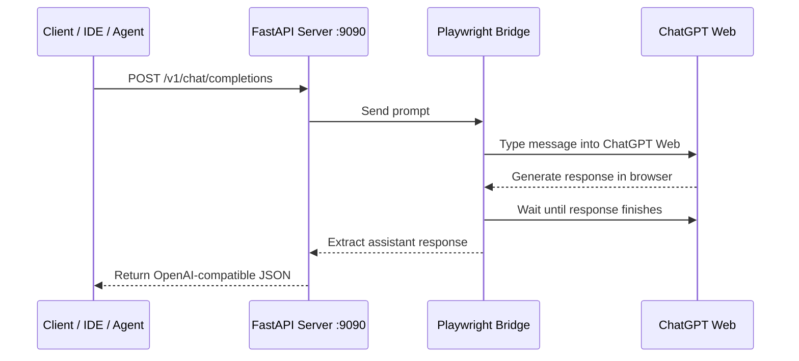

# 🧠 ChatGPT Web Bridge

<div align="center">

[](./LICENSE)
[](https://python.org)
[](https://fastapi.tiangolo.com/)
[](https://playwright.dev/)
[](https://docs.astral.sh/ruff/)
[](./CHANGELOG.md)
[](./CHANGELOG.md)

**OpenAI-compatible local API bridge powered by ChatGPT Web browser automation.**

Built by **deco31416.com** for local experiments, agent workflows, IDE integrations, and controlled automation.

</div>

---

## 📌 Overview

**ChatGPT Web Bridge** is a local FastAPI server that exposes an OpenAI-compatible interface, including:

* `GET /v1/models`
* `POST /v1/chat/completions`
* `GET /health`

Instead of calling the official OpenAI API directly, this bridge sends prompts to the ChatGPT Web UI through a controlled Playwright browser session.

In simple terms:

> Your local tools talk to this server as if it were an OpenAI API.
> This server opens ChatGPT Web in a browser, sends the message, reads the answer, and returns it in OpenAI-compatible JSON format.

---

## ⚠️ Important Notice

This project is **experimental software**.

It depends on browser automation and the ChatGPT Web interface, which may change at any time. Selectors, page behavior, login requirements, rate limits, and response timing may break without notice.

This project is intended for:

* Local development
* Personal experimentation
* Internal tools
* IDE integrations
* Agent prototyping

It is **not recommended** for production, public deployment, resale as a hosted API, or high-volume automated usage.

---

## 📋 Table of Contents

* [Overview](#-overview)
* [Important Notice](#️-important-notice)
* [What It Does](#-what-it-does)
* [Architecture](#-architecture)
* [Project Structure](#-project-structure)
* [Quick Start](#-quick-start)
* [API Reference](#-api-reference)
* [Configuration](#️-configuration)
* [Client Integration](#-client-integration)
* [Security Considerations](#-security-considerations)
* [Troubleshooting](#-troubleshooting)
* [Roadmap](#-roadmap)
* [Changelog](#-changelog)
* [Contributing](#-contributing)
* [License](#-license)

---

## 🎯 What It Does

**ChatGPT Web Bridge** allows local OpenAI-compatible clients to interact with ChatGPT Web through a browser session.

### Main Features

* OpenAI-compatible `/v1/chat/completions` endpoint
* OpenAI-compatible `/v1/models` endpoint
* Local FastAPI server
* Playwright-based browser automation
* ChatGPT Web session reuse
* JSON responses compatible with OpenAI SDK clients
* Basic health endpoint
* Windows-friendly launch scripts
* MIT license under **deco31416.com**

---

## 🧩 Why This Project Exists

Many tools, agents, IDE plugins, and local workflows expect an OpenAI-compatible API endpoint.

This project provides a local bridge so those tools can send requests to a browser-controlled ChatGPT Web session.

| Traditional API Flow             | ChatGPT Web Bridge Flow               |
| -------------------------------- | ------------------------------------- |
| Client calls OpenAI API directly | Client calls local FastAPI server     |
| Requires API key                 | Uses a logged-in ChatGPT Web session  |
| Token billing through API        | Uses your existing ChatGPT web access |
| Stable API contract              | Experimental browser automation       |
| Production-ready API behavior    | Local experimental bridge             |

---

## 🏗 Architecture



---

## 🗂 Project Structure

```text
idea-loca/
├── server.py              # FastAPI application entry point
├── chatgpt_bridge.py      # Playwright automation layer
├── models.py              # Pydantic request/response schemas
├── requirements.txt       # Python dependencies
├── run.ps1                # PowerShell launcher for Windows
├── run.bat                # Batch launcher for Windows
├── CHANGELOG.md           # Version history
├── CONTRIBUTING.md        # Contribution guidelines
├── LICENSE                # MIT License - deco31416.com
└── README.md              # Project documentation
```

---

## 🚀 Quick Start

### Requirements

* Python `3.11` or higher
* Windows, Linux, or macOS
* Google Chrome or Chromium
* Playwright
* A ChatGPT account
* Active ChatGPT Web session

---

### 1. Enter the Project

```powershell
cd idea-loca
```

---

### 2. Create a Virtual Environment

```powershell
python -m venv .venv
```

---

### 3. Activate the Environment

#### Windows PowerShell

```powershell
.venv\Scripts\Activate.ps1
```

#### Windows CMD

```cmd
.venv\Scripts\activate.bat
```

#### Linux / macOS

```bash
source .venv/bin/activate
```

---

### 4. Install Dependencies

```powershell
pip install -r requirements.txt
```

---

### 5. Install Playwright Browser

```powershell
playwright install chromium
```

---

### 6. First Run: Visible Browser Login

Use visible browser mode the first time so you can log in manually.

```powershell
python server.py --port 9090 --no-headless
```

When the browser opens:

1. Log into ChatGPT.
2. Make sure the ChatGPT page loads correctly.
3. Keep the browser session active.
4. Test the API from another terminal.

---

### 7. Normal Run

After the login session is saved, you can run the bridge normally.

```powershell
python server.py --port 9090
```

---

## 📡 API Reference

---

### `GET /health`

Checks whether the local bridge is running and whether the ChatGPT session appears usable.

#### Example Request

```bash
curl http://localhost:9090/health
```

#### Example Response

```json
{
  "status": "ok",
  "authenticated": true,
  "bridge": "chatgpt-web-bridge"
}
```

---

### `GET /v1/models`

Returns model identifiers in an OpenAI-compatible format.

#### Example Request

```bash
curl http://localhost:9090/v1/models
```

#### Example Response

```json
{
  "object": "list",
  "data": [
    {
      "id": "gpt-4o",
      "object": "model",
      "created": 1715367049,
      "owned_by": "chatgpt-web"
    },
    {
      "id": "gpt-4o-mini",
      "object": "model",
      "created": 1715367050,
      "owned_by": "chatgpt-web"
    },
    {
      "id": "o3",
      "object": "model",
      "created": 1735680000,
      "owned_by": "chatgpt-web"
    },
    {
      "id": "o4-mini",
      "object": "model",
      "created": 1735680001,
      "owned_by": "chatgpt-web"
    },
    {
      "id": "gpt-4.1",
      "object": "model",
      "created": 1740000000,
      "owned_by": "chatgpt-web"
    }
  ]
}
```

> Note: The requested model identifier is accepted for compatibility, but the actual response depends on the active ChatGPT Web session and selected/default model behavior.

---

### `POST /v1/chat/completions`

OpenAI-compatible chat completions endpoint.

#### Example Request

```json
{
  "model": "gpt-4o",
  "messages": [
    {
      "role": "user",
      "content": "Explain quantum computing in 3 sentences."
    }
  ],
  "temperature": 0.7
}
```

#### Example Response

```json
{
  "id": "chatcmpl-a1b2c3d4e5f6",
  "object": "chat.completion",
  "created": 1715367049,
  "model": "gpt-4o",
  "choices": [
    {
      "index": 0,
      "message": {
        "role": "assistant",
        "content": "Quantum computing uses qubits, which can represent more than just 0 or 1. This allows certain problems to be processed differently from classical computers. It is especially promising for optimization, simulation, and cryptography-related research."
      },
      "finish_reason": "stop"
    }
  ],
  "usage": {
    "prompt_tokens": 8,
    "completion_tokens": 42,
    "total_tokens": 50
  }
}
```

#### Supported Request Fields

| Parameter     |    Type | Required | Behavior                                    |
| ------------- | ------: | -------: | ------------------------------------------- |
| `model`       |  string |      Yes | Accepted for compatibility                  |
| `messages`    |   array |      Yes | Last user message is sent to ChatGPT Web    |
| `temperature` |  number |       No | Accepted for compatibility                  |
| `max_tokens`  |  number |       No | Accepted for compatibility                  |
| `stream`      | boolean |       No | May be accepted depending on implementation |

---

## ⚙️ Configuration

### CLI Arguments

| Argument        | Default | Description                                  |
| --------------- | ------: | -------------------------------------------- |
| `--port`        |  `9090` | Local server port                            |
| `--no-headless` | `false` | Opens visible browser window for login/debug |

---

### Environment Variables

| Variable      | Default                | Description          |
| ------------- | ---------------------- | -------------------- |
| `CHATGPT_URL` | `https://chatgpt.com/` | ChatGPT Web base URL |

---

## 🔌 Client Integration

---

### Python - OpenAI SDK

```python
from openai import OpenAI

client = OpenAI(
    base_url="http://localhost:9090/v1",
    api_key="sk-local-no-key-required",
)

response = client.chat.completions.create(
    model="gpt-4o",
    messages=[
        {
            "role": "user",
            "content": "Hello from Python!"
        }
    ],
)

print(response.choices[0].message.content)
```

---

### cURL

```bash
curl -s http://localhost:9090/v1/chat/completions \
  -H "Content-Type: application/json" \
  -d '{
    "model": "gpt-4o",
    "messages": [
      {
        "role": "user",
        "content": "What is 2 + 2?"
      }
    ]
  }' | python -m json.tool
```

---

### TypeScript / Node.js

```typescript
import OpenAI from "openai";

const client = new OpenAI({
  baseURL: "http://localhost:9090/v1",
  apiKey: "sk-local-no-key-required",
});

const response = await client.chat.completions.create({
  model: "gpt-4o",
  messages: [
    {
      role: "user",
      content: "Hello from TypeScript!",
    },
  ],
});

console.log(response.choices[0].message.content);
```

---

### Continue.dev Example

```json
{
  "models": [
    {
      "title": "ChatGPT Web Bridge",
      "provider": "openai",
      "model": "gpt-4o",
      "apiBase": "http://localhost:9090/v1",
      "apiKey": "sk-local-no-key-required"
    }
  ]
}
```

---

## 🔒 Security Considerations

This bridge controls a real browser session. Treat it as sensitive software.

| Risk                         | Recommendation                                                           |
| ---------------------------- | ------------------------------------------------------------------------ |
| Exposing the server publicly | Bind only to `localhost`. Do not expose it to the internet.              |
| Session hijacking            | Protect the Playwright profile and browser session files.                |
| Account abuse detection      | Avoid high-volume automated requests. Add delays and rate limits.        |
| UI selector changes          | Keep the Playwright selectors updated.                                   |
| Sensitive prompts            | Do not send secrets, private keys, passwords, or production credentials. |
| Shared machines              | Do not run with an authenticated ChatGPT session on untrusted computers. |

---

## 🚫 Production Warning

Do **not** deploy this as a public API service.

This project is not a replacement for the official OpenAI API. It is a local bridge for controlled personal or internal use.

Avoid:

* Public hosting
* Multi-user SaaS exposure
* Reverse proxying to the internet
* Selling hosted access
* High-frequency automation
* Sending confidential production data

---

## 🐛 Troubleshooting

| Symptom                       | Likely Cause                        | Suggested Fix                                    |
| ----------------------------- | ----------------------------------- | ------------------------------------------------ |
| `Bridge no inicializado`      | Browser bridge is not ready         | Wait until the bridge initialization logs appear |
| `No se detectó sesión activa` | ChatGPT is not logged in            | Run with `--no-headless` and log in manually     |
| `Timeout`                     | ChatGPT Web is slow or rate-limited | Retry later or reduce request frequency          |
| `No se encontró respuesta`    | UI selectors changed                | Update selectors in `chatgpt_bridge.py`          |
| Import error                  | Missing dependencies                | Run `pip install -r requirements.txt`            |
| Browser does not open         | Playwright browser missing          | Run `playwright install chromium`                |
| Client cannot connect         | Wrong port or server not running    | Confirm `http://localhost:9090/health` works     |

---

## 🧪 Local Test

After starting the server, run:

```bash
curl http://localhost:9090/health
```

Then test a completion:

```bash
curl -s http://localhost:9090/v1/chat/completions \
  -H "Content-Type: application/json" \
  -d '{"model":"gpt-4o","messages":[{"role":"user","content":"Say hello in one sentence."}]}'
```

---

## 🧭 Roadmap

Planned improvements may include:

* Better request queue handling
* Local rate limiting
* More robust selector recovery
* Optional conversation isolation
* More complete OpenAI API compatibility
* Better streaming compatibility
* Structured error codes
* Better logging and diagnostics

---

## 📄 Changelog

See [`CHANGELOG.md`](./CHANGELOG.md) for version history.

---

## 🤝 Contributing

Contributions are welcome.

Before opening a pull request:

1. Keep the project local-first.
2. Avoid adding unnecessary complexity.
3. Do not introduce unsafe public-exposure defaults.
4. Keep code readable and easy to audit.
5. Update documentation when behavior changes.

See [`CONTRIBUTING.md`](./CONTRIBUTING.md) for more details.

---

## 📜 License

MIT © **deco31416.com**
See [`LICENSE`](./LICENSE) for the full license text.

---

## 🏷 Branding

This project is maintained under the **deco31416.com** name.

The MIT license allows use, modification, distribution, and sublicensing of the software, but it does not grant permission to misuse the **deco31416.com** name, identity, branding, domain, logos, or public reputation beyond required copyright and license attribution.

---

<div align="center">

**Made with 🧠 by deco31416.com**

<sub>Experimental local bridge for ideas locas que funcionan.</sub>

</div>
